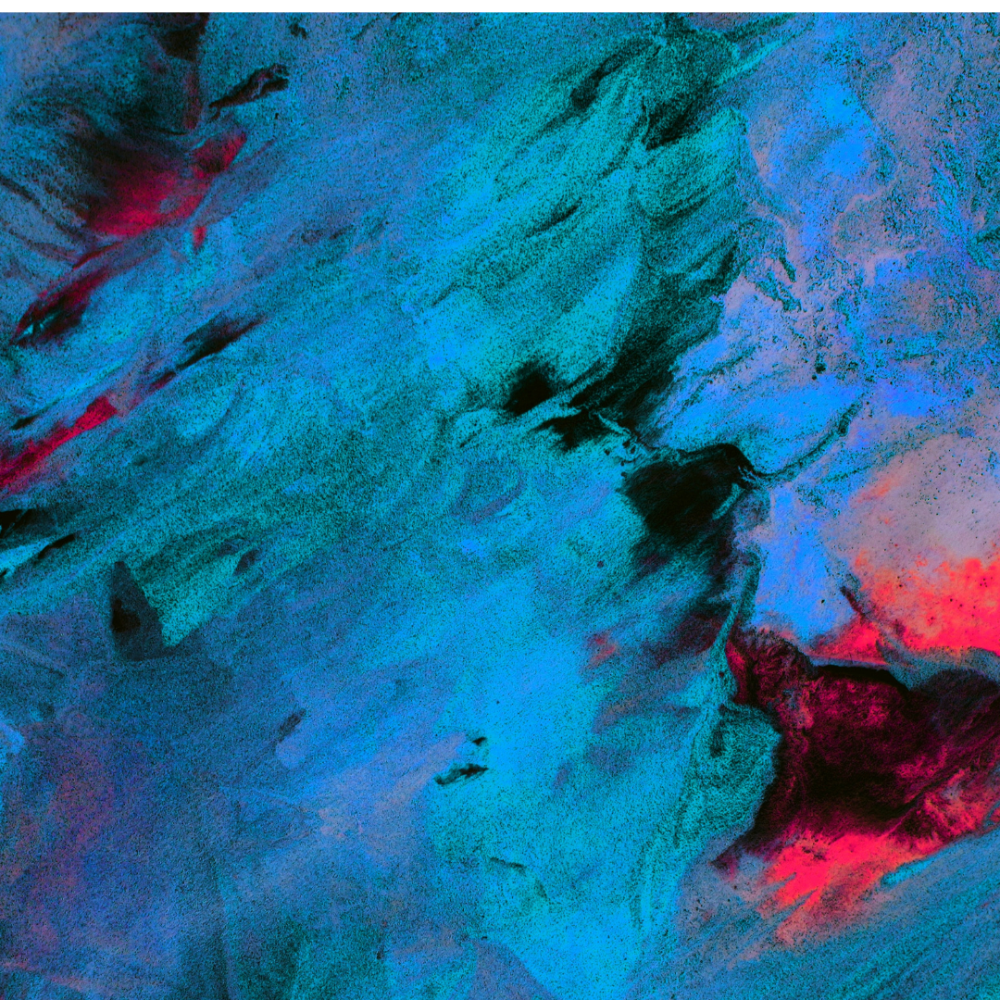

## A Fork In the Road

Life has its high expectations especially when it comes to figuring out what to be when you “grow up”. During my senior year of high school, I did not exactly know what major I wanted to pursue. I have had this subconscious belief that in order to be successful I have to become a nurse or an engineer. With this engraved in my mind, I have set standards that were so incredibly excessive that whenever I did fall short of certain aspects in life, I found myself questioning...Am I doing this right? Nevertheless, I was hitting a fork in the road in which either path inevitably led to another one. Despite the multiple forks I have hit along the way, it brought me to where I am today, pursuing a degree that I have grown to love. Computer Science is definitely a path I would not have guessed to have been of my interest, though I have come to realize that it is definitely the path I have been looking for.

## Computer Science is An Art Form

The arts have always been something that fascinated me as I have always grown fond of creativity. After diving into the world of Computer Science, I can definitely say that is an art form. Prior to learning about it, I always believed Computer Science would be a field that is focused primarily on math and analytical designs, but it is much more than that. This art form is seen everywhere from social media applications all the way to innovative technological designs such as Tesla. By immersing myself in various aspects of Computer Science, I have come to learn that despite its challenges the process is quite exhilarating and the results are surely fulfilling. The possibilities are endless allowing my creativity to flow with no bounds. My absolute favorite part about Computer Science is how vast it is. From web design to game development those are just a few of its great wonders. Personally, I have developed a keen desire to learn more about software development (no pun intended). I feel that if I improve upon my skills in it, I will truly be able to turn what are once ideas in my head…into reality. 

## Innovation is My Goal

As I further my education at the University of Hawaii at Manoa, I look forward to enhancing my Software Development skills. I have a keen interest in immersing myself in everything, from internships, to projects, group works and so forth. By doing so, I am hopeful to put those skills into creating change that will make a mark in the world. Though it won’t be an easy journey, I am ready to face the challenges that may come into play as well as surpassing the forks in the road. Like art, computer science is universal, it has the power to move people and undeniably has no bounds. Today, I can proudly say that I can answer the question I have always found myself asking and that is...no, but with some practice and determination I will never lose sight of the bigger picture. 
