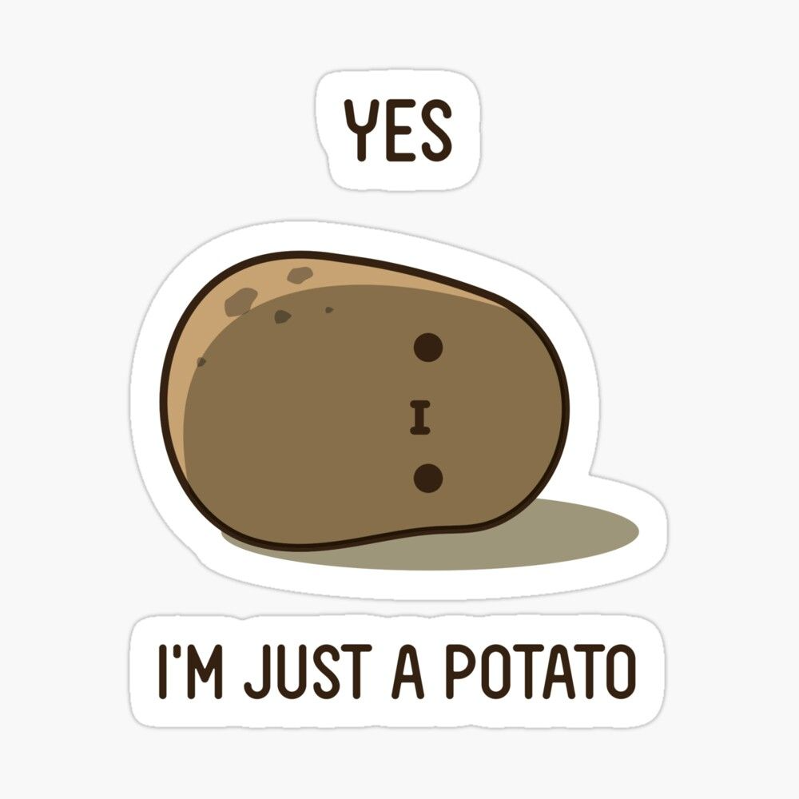

Potatoes are one of a kind. It can be incorporated into so many different dishes, manipulated in countless delicious ways and is just downright lovable. When you think about it there's nothing else that really needs to change, besides how it's cook or how you choose to incorporate it into your dish. The same applies to the concept known as Design Patterns. What is Design Patterns you might ask? Well for starters it's not a food, but it's definitely something you've unknowingly consumed across many various platforms.

Design patterns is what I would describe as the ultimate potato recipe book, in that it is a template of how one should go about solving a problem in different aspects of software design. To elaborate, recipe books generally have pretty detailed step by step process of how to make certain dishes..but let's look at this recipe book as if it does not have EXACT measurements of ingredients nor time, essentially just a general explanation of how that dish must be made. By looking at our recipe this way, we kind of have a better grasp as to what design patterns really are. To say the least, design patterns lay the groundwork for us to build upon. It is our potato recipe book that we reference from time to time, allowing us to use the tools and ingredients we have, to create something similar but not identical as to what they have given us.

Right now you may be viewing design patterns in the grand scheme of Software Design. However, there's more to it...similar to how potatoes are used as appetizers, an entree, and dare I say it, a dessert. Similarly, we can break down design patterns into three categories: Creational, Structural, and Behavioral. In the simplest of terms, creational is the ability to create objects that fits the criterion for the problem. So let us say we are trying to make an appetizer with the potato as the main ingredient. We can break down the different classes to be the ways we can cook the potato: fried, boiled, or baked. Moving on we have structural design patterns, and these have the ability to define ways to compose different objects with additional functionalities. So let us continue upon the potato scenario. Besides how we cook the potato, we want to know what each additional ingredient such as spices, flours, or herbs would contribute when we add them in. So in other terms, the dish is still clearly a potato the only thing that changes is the ingredients that were used to elevate its taste. Last but not least is behavioral design patterns. Behavioral design patterns are essentially highlights the communication between objects, one thing I like to reference it to is almost a cause and effect scenario. Relating it back to our beloved potato example, behavioral patterns is like the interaction between the person eating the dish, the dish itself, and the chef who made it. If the dish is not enjoyed by the consumer, the chef will be "notified" and will make improvements on the dish.

Personally, saying that design patterns is a really cool concept, would be an understatement. Like a potato, it is fascinating and there is so much that could be done with it. I know this because similar to how much types of potato dishes I have consumed, I have experienced a fair share amount of design pattern implementation in previous projects. One notable project that myself and a few other awesome individuals are working on is an app known as [OverEasi](https://overeasi.github.io/). This app implements what I would claim a decent example of design patterns. An example is the aspect known as Model-View-Controller. The model in this project is the one and only MongoDB. MongoDB is responsible for our collections, such as the intents, reports, and messages. The "view" is essentially the pages of the website which is structured using Semantic UI React. Last but not least is the "controller" which is simply a router that allows for navigation across the different features of the application.

Design patterns is one of those concepts that are vast and constantly expanding but when you try to get to the root of it...it is a simple structure that just works. Like a potato it can stand on its own, but building upon it, adding other ingredients, throwing your own personal twist gives it a layer of uniqueness. And to be dramatic here for a moment...sometimes a groundbreaking creation can stem from it. Just look at a scalloped potato recipe for crying out loud, that is a brilliant creation in my book. So know that you have an idea of what design patterns are, put on your coding hat on. Go out there and give it a fry, I mean a try. Perhaps you'll be the next master coder that makes something as good or if not better creation than a loaded bake potato.

