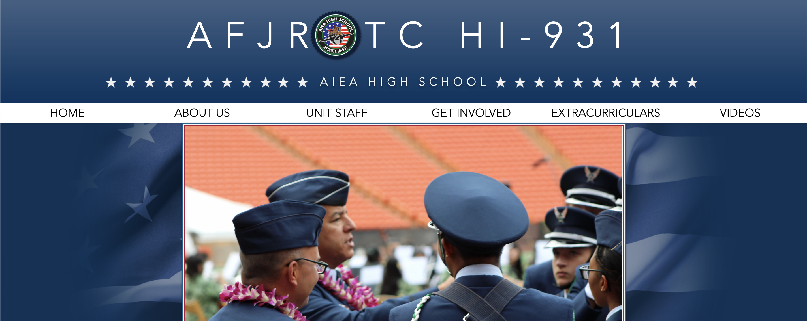

 

My senior year of high school I held the position as the Webmaster for Aiea High School’s AFJROTC. At the time, the website included content that was outdated and the aesthetics were fairly generic. My responsibilities were not specified into detail as the goals of the squadron was directed toward other aspects of JROTC. With free range as to what changes could be made, I proposed an idea to take on the task of revamping the website. Nevertheless, my proposal was approved and I wholeheartedly made it my goal to make something no one has seen before.

The AFJROTC website was assembled through the website company known as Wix. During this point in time, I had no coding background nor any true software development skills. However, it taught me significantly about building a professional image. My favorite part about this project would probably have to be the research that went alongside building a professional website. During my research, I viewed a variation of websites that emulated an ideal design, this ranged from mortgage companies, non-profit organizations, and most importantly other AFJROTC websites. Gauging as to what content is most prevalent among these especially within the AFJROTC websites, allowed me to plan what main sections must go on the navigation bar. Furthermore, by analyzing other websites, it helped me determine what kind of content will set us apart from similar sites out there.

I divided the website into four main sections: the Home Page, About Us, Unit Staff, and Extracurriculars. The Home Page included large pictures, complemented with short anecdotes that caters to the audience's attention. The About Us had details that were originally included with the added touch of related and current pictures of the unit. The Extracurricular included different aspects of AFJROTC: Drill Team, Special Forces Team, and Kitty Hawk. Within these areas, the duties and responsibilities of each section are revealed serving as an informative source for future cadets. The last and most time consuming aspect of this project was the Unit Staff page. For this page, I had to generate an organizational chart for the unit’s chain of command.

See more about [_Aiea AFJROTC_](https://www.aieaafjrotc.com/copy-of-about-us).
