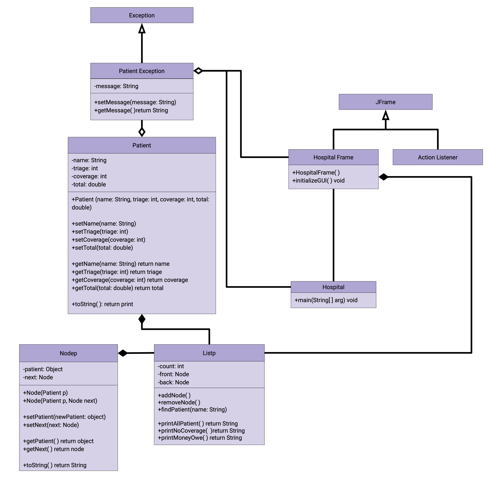

Java Hospital is a program I have developed as a final project in ICS 211. This program is compiled of different classes and interfaces worked on over a course of a month and half. Fundamentally, it was one of the first big projects I have ever done. The build up took time and a lot of patience. Nevertheless, it was a beneficial learning experience allowing for the application of a variation of coding algorithms. This includes, building upon class interfaces, extending JFrame and exception classes, creating graphical user interfaces, and utilizing double linked lists. Despite such a time-consuming and stress-inducing project, it proved to be an essential learning experience.

## The Anatomy of Java Hospital
Java Hospital is a Graphical User Interface that serves as a form of Hospital management system which enables the user to carry out 6 different functionalites.


>  1. Add a patient to the hospital.
>  2. Delete a patient from the hospital.
>  3. Find a patient by name and display their information onto the screen.
>  4. List all the patients.
>  5. List all the patients without insurance (0% coverage).
>  6. List all the patients that owe more than a given amount.

A **patient object** is only created when it meets the following parameters:
>  - Patient name must be at least 5 non-blank characters long.
>  - The level of triage must be an integer between 1-5; 1 being extremely urgent and 5 a normal vist.
>  - The coverage value is on a percentage scale and must be between 0-100.

If any of the parameters are not met an **exception will be thrown** and may look like the following images below.

<div class="ui medium rounded images">
   
   
   
</div>

**Valid parameters** will execute the function selected by the user. An example of this is below.

<div class="ui large rounded images">
  
  
</div>

Here are some lines of code from the _Patient Class_ that checks if the parameters are valid before creating a _Patient Object_:

```js
  public void setTriage(int newTriage) throws PatientException{
      switch(newTriage){
         case (1): level = "EXTREMELY Urgent.";
            break;
         case (2): level = "HIGH Risk";
            break;
         case (3): level = "MEDIUM Risk";
            break;
         case (4): level = "LOW Risk";
            break;
         case (5): level = "Routine Visit";
            break;
         default: 
            PatientException pe = new PatientException( );
            pe.setMessage("***The level of triage you entered is not within the range of 1-5.***");
            throw pe;
      }
      this.triage = newTriage;  
   }
```   

For this project, understanding the structure of the system is key in order to have a functioning program that executes every intended functionalities. To assist in this process a **Unified Modeling Language Diagram** better known as a UML Diagram can be constructed to help visualize the object oriented systems. Essentially within this UML the structure of the system is described by showing the classes, its attributes, its methods, as well as the relationships	among the different objects. Below is a UML Diagram for the _Java Hospital_.


