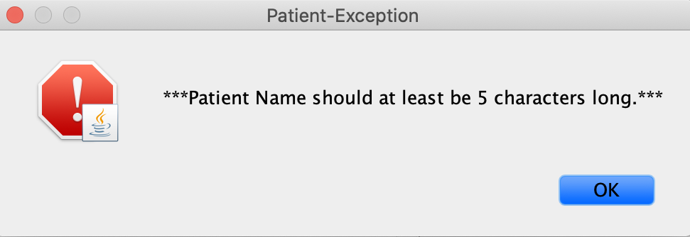
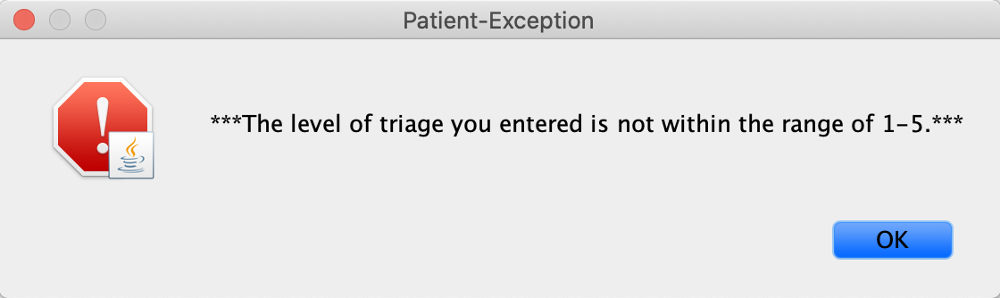
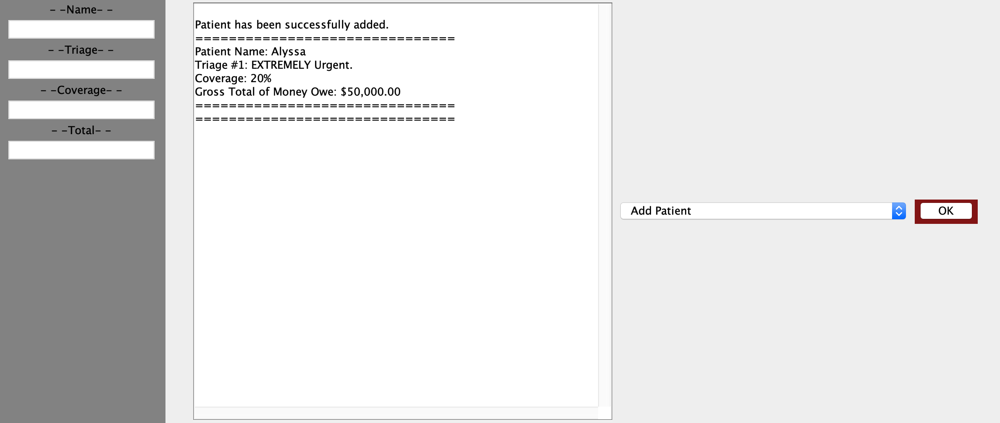

Java Hospital is a Graphical User Interface that serves as a form of Hospital manage system which enables the user to carry out 6 different functionalites.

>  1. Add a patient to the hospital.
>  2. Delete a patient from the hospital.
>  3. Find a patient by name and display their information onto the screen.
>  4. List all the patients.
>  5. List all the patients without insurance (0% coverage).
>  6. List all the patients that owe more than a given amount.

A **patient object** is only created when it meets the following parameters:
>  1. Patient name must be at least 5 non-blank characters long.
>  2. The level of triage must be an integer between 1-5; 1 being extremely urgent and 5 a normal vist.
>  3. The coverage value is on a percentage scale and must be between 0-100.

If any of the parameters are not met an **exception will be thrown** and may look like the following images below.

  
  
  

**Valid parameters** result in the following images provided below.

  
  

