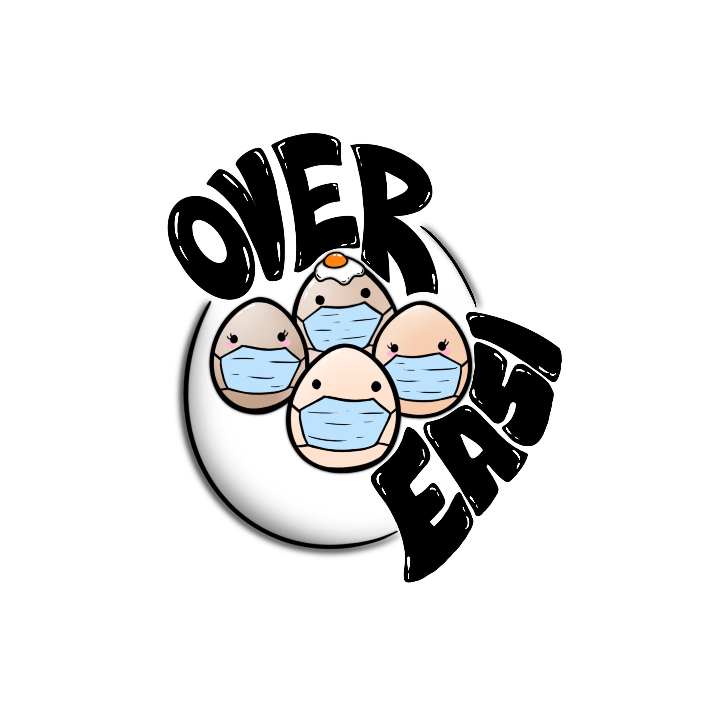
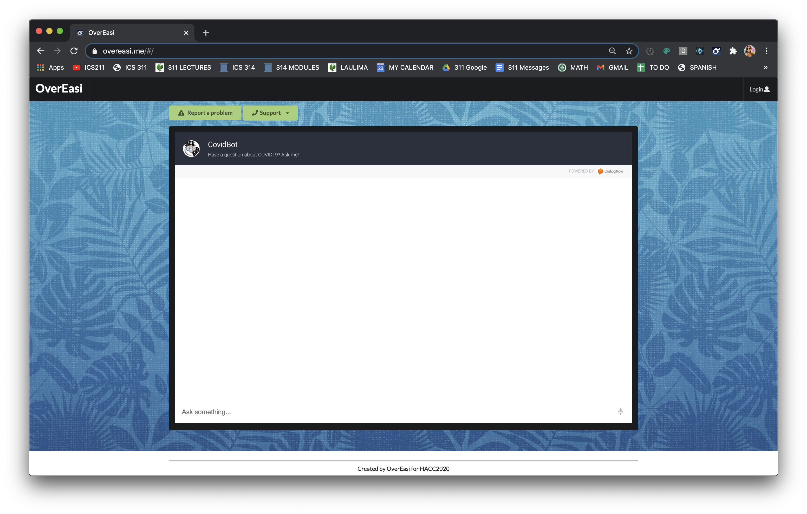

# The egg is still boiling, more coming soon...

  

**OverEASI** is a web application that I helped create as a team project in ICS 314, Fall 2020, and simultaneously as a Hawaii Annual Coding Challenge solution. This project allowed me to explore the work that goes on to creating a responsive website that is flexible and easy to use.

#### Landing Page
  

You can learn more at the [OverEasi](https://overeasi.github.io/).

