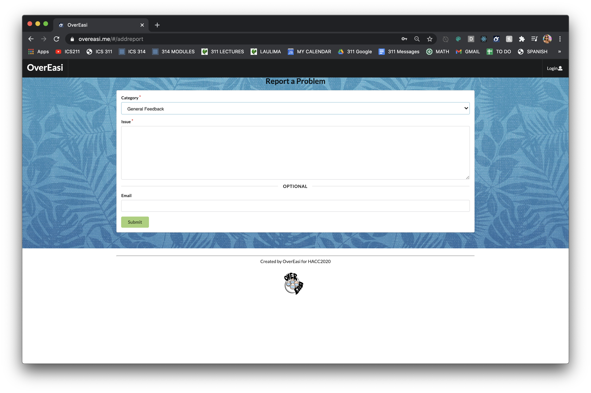
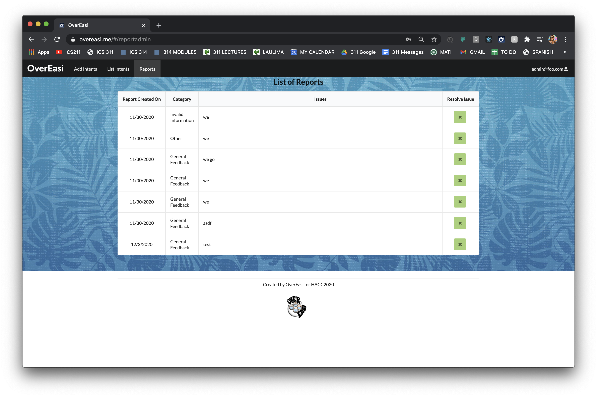

  

**OverEASI** is a web application that I helped create as a team project in ICS 314 (Fall 2020), and simultaneously as a NIC Hawaii chat-bot challenge solution for the [Hawaii Annual Coding Challenge (HACC) 2020](https://devpost.com/software/overeasi?ref_content=user-portfolio&ref_feature=in_progress). This project allowed me to explore the work that goes on to creating a responsive website that is flexible and easy to use.

The goal of this application was to provide a one-stop-shop for COVID-19 information related to Hawaii. Besides the chat-bot, it incorporates the Dialogflow Google Cloud Service, and implements pages accessible only to the admin that allow for easy maintenance of this bot. For example:

#### Landing Page
The user is prompted to a landing page containing the chat-bot itself and an additional feature that allows them to report a problem they may come across.
  

#### Report Feature
The reports feature was what I was responsible for tackling in this project. My initial tasks included creating a collection of reports using MongoDB and creating a skeleton for what the reports page on the user side would look like. Once I covered the basics of it, I covered the report page on the admin side. Here the reports that the users have made are listed according to the time that they have been submitted.

##### User Report Page
  
The user is presented with a form fillable that allows them to select the type of problem they have encountered: General Feedback, Invalid Information, Syntactic Error, System Malfunction, and Other. The "issue" textfield enables the user to explain the problem they encountered in depth. 

##### Admin Report Page
  
The admin is presented with a table that lists the submitted reports from oldest to most recent. Here the admin can view what category this issue falls under as well as a detailed feedback of what the problem was. Once the issue has been resolved the admin has the accessibility to resolve the reported issue.

You can learn more at <a href="https://overeasi.github.io/"><i class="large github icon"></i>OverEasi</a>.

