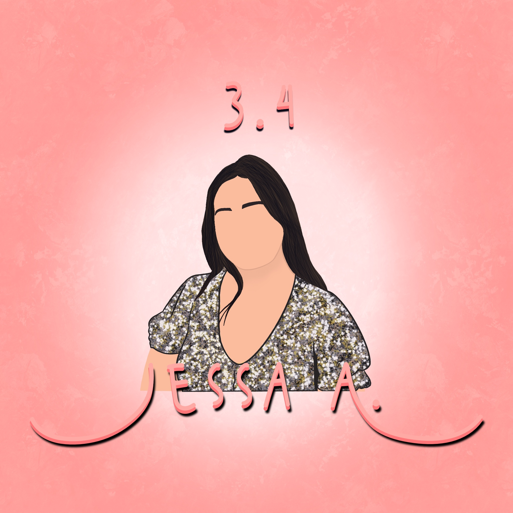
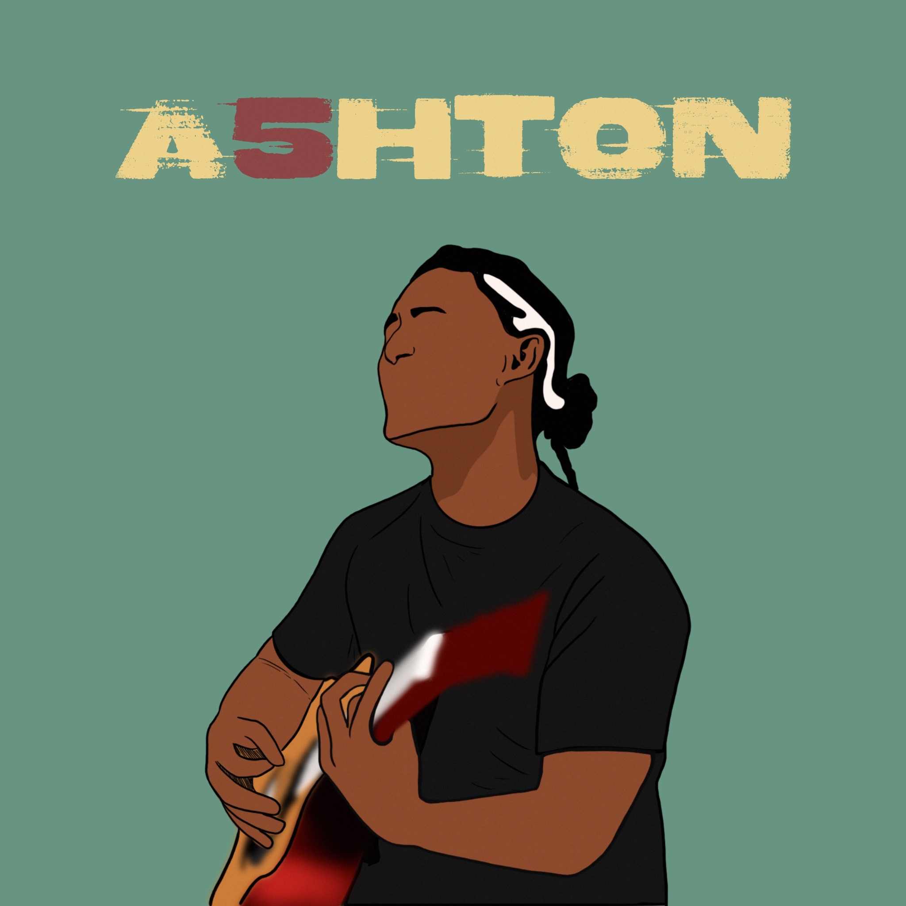
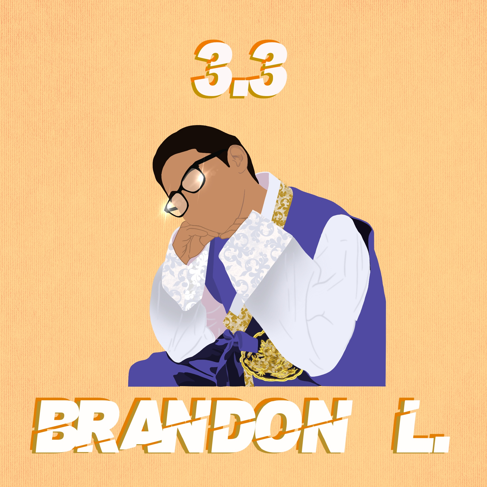
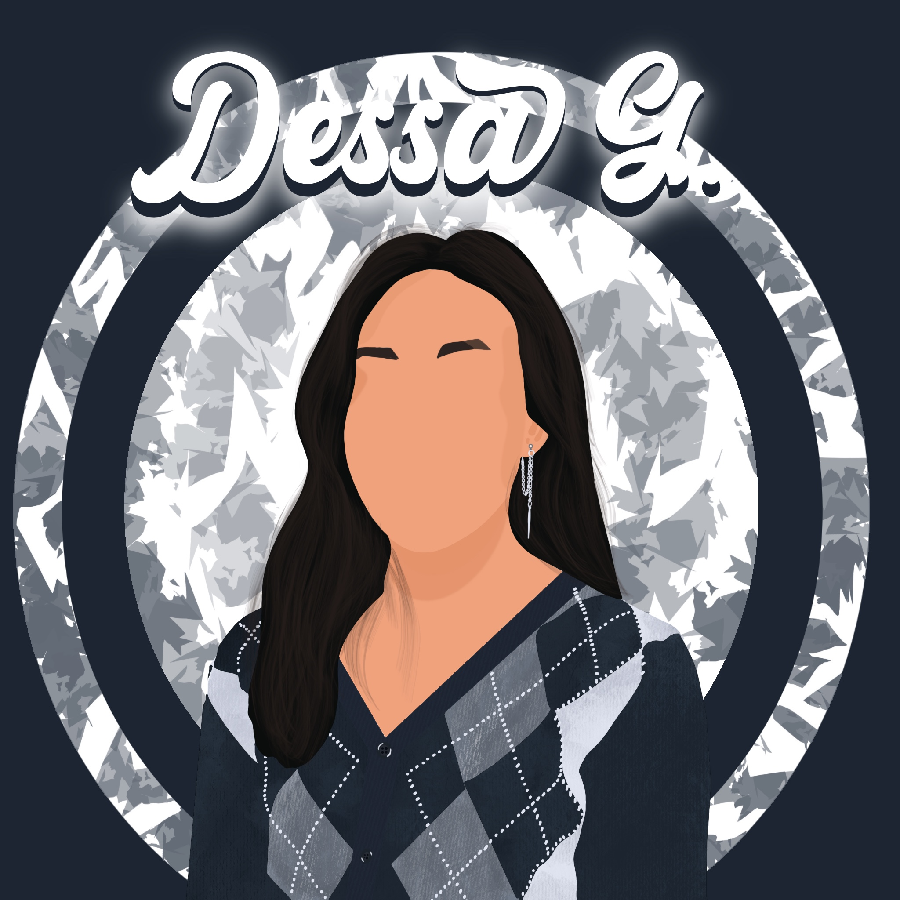
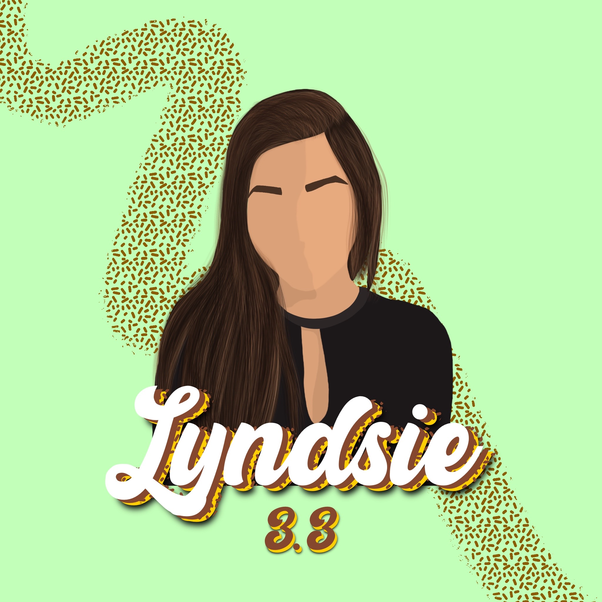
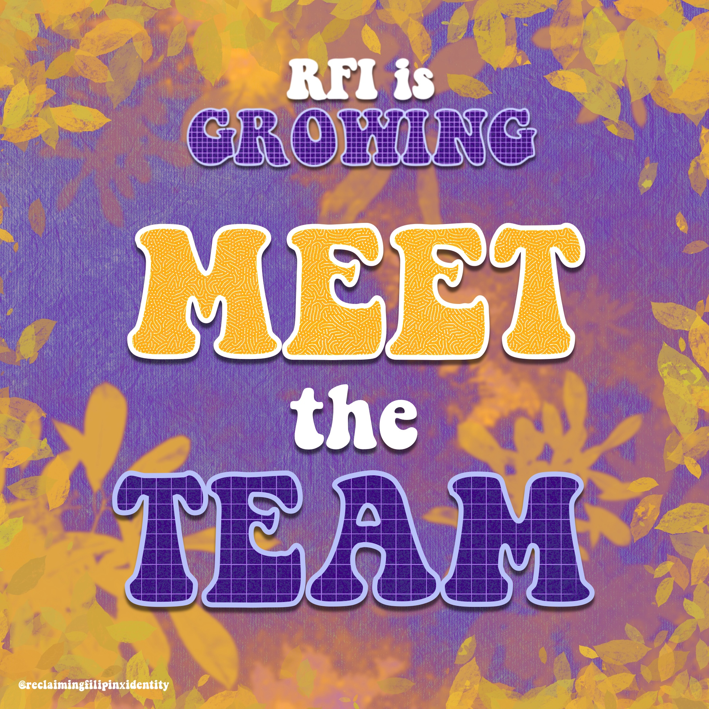
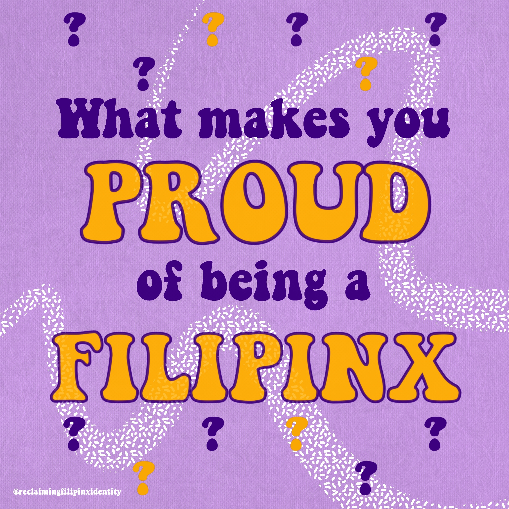

 

**Reclaiming Filipinx Identity** is an independent Media company that is 100% self funded. 

Since creating a podcast that not only captures narratives for the Filipinx community in Hawaii. We also wanted to branch to a media company to bridge the gap with the many different Filipinos globally by creating an open space for healthy conversation.
 

As fellow Kasama and Kababayans, Reclaiming Filipinx Identity continues to create content that will bridge the gap with different issues that is happening to the community by addressing it through series like our 'FIlipinx Mental Health Mukbang' and many more content to follow.
 

## The Minds Behind RFI
>_Founder, Director of Operations_—Chachie Abara

>_Audio Producer_ — Jethro Macaraeg

>_Production Coordinator_ — Tiffany Sagucio

>_Social Media Manager/Content Coordinator_ — Jasmine Padamada

>_Marketing Analyst_ — Shane Cobacha

>_Graphic Designer_ — Franz Cabuco

>_Graphic Designer/Production Assistant_ — Alyssandra Cabading

## The Mission Statement
>To capture the narratives of Filipino Americans and Local Filipinos  in Hawaii and to start and continue the dialogue that will help  order to embrace change and bring solidarity. 

## My Role
>The sole duties of a Graphic Designer is in its name. Some responsibilities include designing infographics and the company's logo. As a Production Assistant, I am partly responsible for the type of content we create as well as how it is put out to the public. To go into more detail, my contribution include editing Youtube videos in which a set of guest panelists across the country are given the platform to address Mental Health Topics. The podcast aspect of Reclaiming Filipinx Identity caters to Filipinx/Fil-Am in Hawaii. My duties with podcasts are to create cover arts that embodies the story of the guest being interviewed. Occasionally I assist in creating highlights for each podcast episode to share among the audience via Instagram, which is a great segway. For Instragram, my contributions lean more toward the visual content—creating impactful art that captures the audiences attention. Last but not least, the RFI website. The website is most especially my favorite aspect of the company for this is where we provide a platform for those interested in sharing their stories in different forms of art. This include music, poems and narratives. The website is an aspect of our company I desire to improve upon as I learn more about the wonders of Software Development.

## My Contributions

_Podcast Art_

  
  
  
  
  

_Instagram_

  
  
  
  

 
## Learn More

[Youtube Channel](https://www.youtube.com/channel/UCZl2ysSzPtDzDgXSCpr4XZQ?sub_confirmation=1)

[Instagram](https://www.instagram.com/reclaimingfilipinxidentity/?hl=en)

[RFI Website](https://reclaimingfilipinx.wixsite.com/home)

[Podcasts](https://open.spotify.com/show/379URIVL9VEzmXB7WOKJog?si=yfsbxaw9QiqNQQFzSiNFqw)
